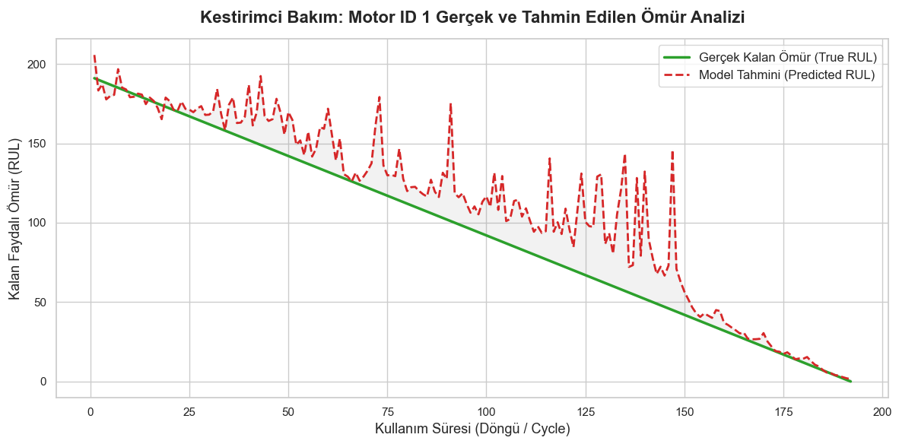

# 🚀 Kestirimci Bakım ve Kalan Faydalı Ömür (RUL) Tahmini

Makine arızalarını gerçekleşmeden önce tahmin ederek plansız duruş maliyetlerini (downtime) en aza indirmeyi hedefleyen makine öğrenmesi tabanlı bir "Erken Uyarı Sistemi" projesidir.

## 📌 Proje Amacı (Business Problem)
Havacılık, üretim ve lojistik operasyonlarında, makinelerin plansız duruşları şirketlere milyonlarca dolara mal olmaktadır. Bu projenin amacı, anlık sensör verilerini analiz ederek çalışan bir makinenin ne zaman arıza vereceğini, yani **Kalan Faydalı Ömrünü (RUL - Remaining Useful Life)** yüksek isabet oranıyla tahmin etmektir. 

## 📊 Veri Seti
Projede, **NASA'nın C-MAPSS (Commercial Modular Aero-Propulsion System Simulation)** veri seti kullanılmıştır. 
* Veriler, sanal ortamda simüle edilen turbofan uçak motorlarının ilk çalışma anından tamamen bozuldukları (run-to-failure) ana kadar sensörlerin kaydettiği 21 farklı termodinamik ölçümü (sıcaklık, basınç, fan hızı vb.) içermektedir.

## 🧠 Özellik Mühendisliği (Feature Engineering)
Makinenin yorulduğunu anlık verilerden ziyade "trendlerden" anlayabilmek için veri setine kritik özellikler eklenmiştir:
* **Hareketli Ortalamalar (Rolling Mean):** Sensörlerin son 5 döngüdeki ortalama değerleri hesaplanarak arızaya giden gidişat (trend) yakalanmıştır.
* **Dalgalanma (Rolling Standard Deviation):** Sensör verilerindeki stabilitenin bozulmasını tespit etmek için son 5 döngünün standart sapması modele dahil edilmiştir.

## ⚙️ Makine Öğrenmesi Modeli
Tahminleme için **Random Forest Regressor (Rastgele Orman)** algoritması tercih edilmiştir. 100 farklı karar ağacından oluşan bu yapı, sensör trendlerini analiz ederek makinenin bozulmasına kalan süreyi döngü (cycle) cinsinden hesaplamaktadır.

## 📈 Performans ve Sonuçlar
Özellik mühendisliği adımları sayesinde modelin arızayı açıklama gücü ciddi şekilde artırılmış ve aşağıdaki skorlar elde edilmiştir:

* **R-Kare (R2) Skoru:** %75 (0.75) 
* **Ortalama Mutlak Hata (MAE):** 23.37 döngü *(Model, makinenin bozulacağı anı ortalama 23 döngülük çok dar bir yanılma payıyla tahmin etmektedir.)*
* **Kök Ortalama Kare Hata (RMSE):** 34.03 döngü

### 📉 Gerçek ve Tahmin Edilen Ömür Analizi

> *Yukarıdaki grafik (Örnek Motor ID: 1), motor yorulup arızaya (0 noktasına) yaklaştıkça modelin tahminlerinin (kırmızı kesik çizgi) gerçek ömre (yeşil çizgi) ne kadar yüksek bir hassasiyetle kilitlendiğini göstermektedir.*

## 🛠️ Kullanılan Teknolojiler (Tech Stack)
* **Veri İşleme:** Python, Pandas, NumPy
* **Makine Öğrenmesi:** Scikit-learn (RandomForestRegressor)
* **Görselleştirme:** Matplotlib, Seaborn

## 💡 Sektörel Kullanım Alanları (Use Cases)
Bu projede kurulan analitik altyapı;
1. **Havacılık (Aviation):** Uçak motorlarının uçuş öncesi bakım planlamasında,
2. **Üretim (Manufacturing):** CNC tezgahları ve üretim bantlarının arıza önleyici bakımlarında,
3. **Tedarik Zinciri (Supply Chain):** Lojistik filo araçlarının motor sağlığı takibinde doğrudan kullanılabilecek bir veri bilimi çözümüdür.
